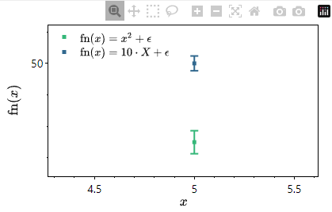

# PlotlyFE: A front end GUI to PlotlyJS

PlotlyFE is a program for quickly making scientific plots. The basic idea is to generate plots fast and simply, without having to write a script (such as matplotlib) or be limited in functionality. The primary functionalities are the following: 

1.  Simple and fast plotting of excel or csv files. Even large (> 100,000 item) datasets are plotted fast and interactions are responsive.

2. Latex math functionality. 

3. Interactive (PlotlyJS) plots - zooming, panning, etc. 

4. Quick adjustment of plot styles. 

5. Easy templating of plot formats. 

6. Embedding of data in plot outputs (data is embedded in SVGs and can be reimported into PlotlyFE). 

   

   

The latest release is available here https://drive.google.com/file/d/1lBnoS_8cQJSsl7EijTpWjktdtfb-F2mE/view?usp=drive_link


# Usage: 


Importing an excel file that looks like picture below left will result in a figure on right. 


Changing some settings and the plot can  look like this: 


You can zoom into individual points: 



Save as SVG or PNG or save this formatting as a template. The SVG can be imported the same way as the excel/csv file and the plot will be regenerated and further updates can be made. 

# Building

To run the program, have node installed and then install the dependencies of the program with 

```bash
npm install 
```

Then run the program with 

```bash
npm run start 
```


### Issues

Issue of "GPU process isn't usable. Goodbye." is solved by adding to main.js

```javascript
app.commandLine.appendSwitch('in-process-gpu');
```


